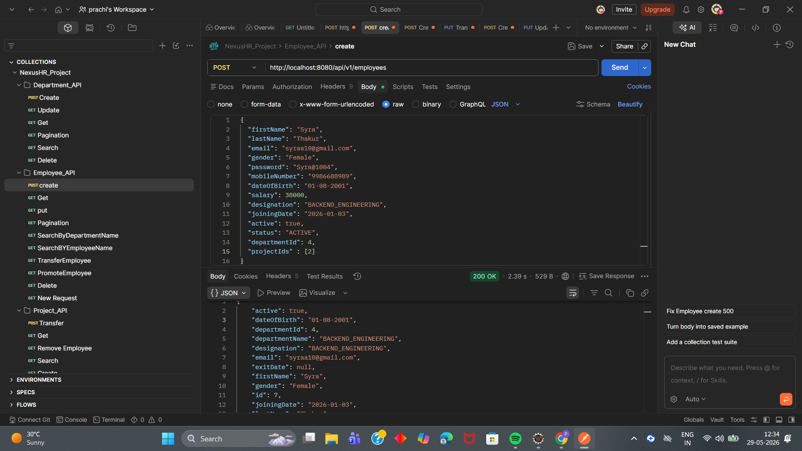
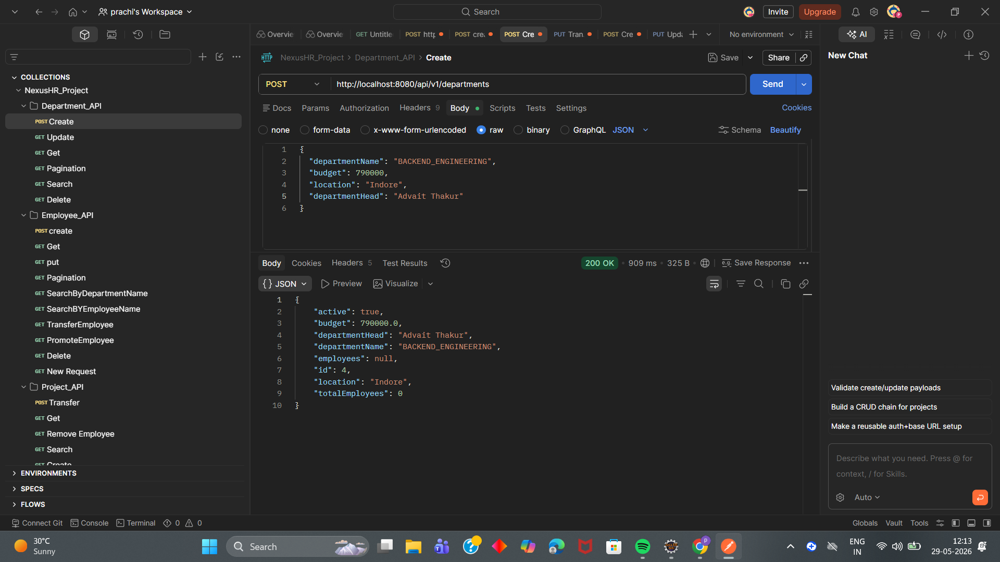
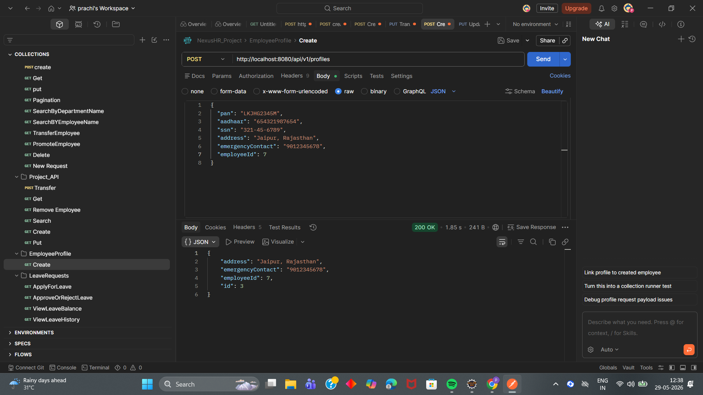
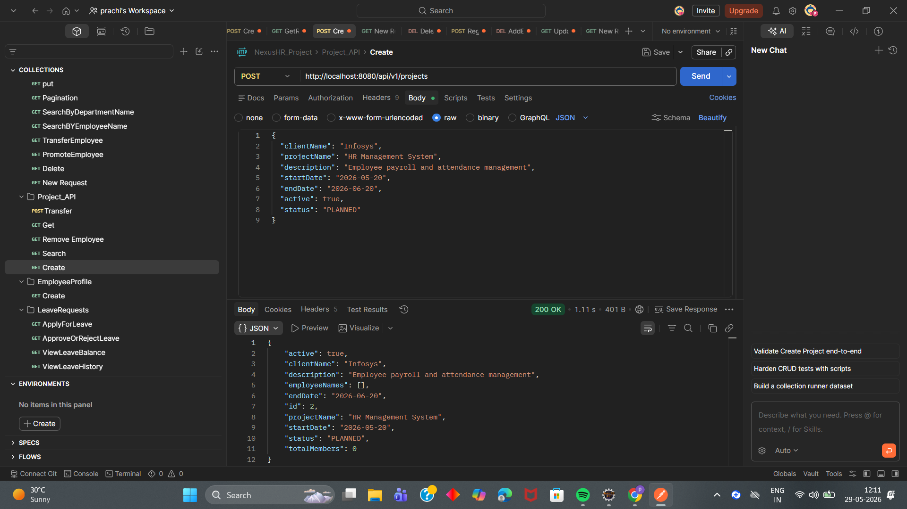
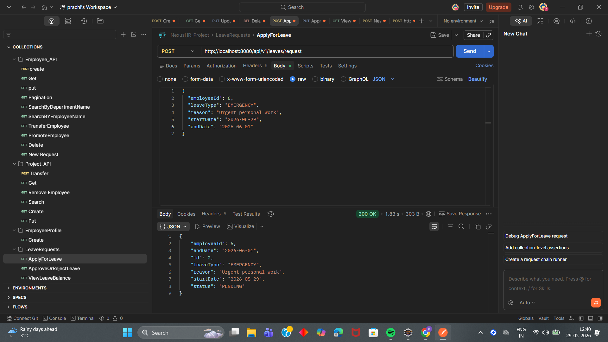

#  NexusHR — Enterprise Employee Management System

<p align="center">
  <strong>Advanced HR Management Backend built with Spring Boot</strong>
</p>

<p align="center">
Manage the complete employee lifecycle — onboarding, departments, promotions, project allocation, leave tracking, analytics, and more.
</p>

<p align="center">


</p>

---

## Live API Access

### Deployed Backend (Render)

The NexusHR backend is deployed on **Render** and APIs can be tested directly using **Swagger UI**.

[https://nexushr-api.onrender.com](https://nexushr-advanced-employee-management.onrender.com)

### Swagger API Documentation

Explore and test all available REST APIs using Swagger UI.

[(https://nexushr-advanced-employee-management.onrender.com/swagger-ui/index.html)](https://nexushr-advanced-employee-management.onrender.com/swagger-ui/index.html)

---

# About The Project

**NexusHR** is an enterprise-grade **Employee Management System** developed using **Spring Boot** and **JPA/Hibernate** that manages the complete employee lifecycle.

The system simulates a real-world HR platform where organizations can:

- Onboard employees
- Manage departments
- Transfer employees
- Promote employees
- Track projects
- Handle leave workflows
- Generate department analytics

The project follows **clean layered architecture**, **DTO pattern**, **bean validation**, **transaction management**, and **REST API best practices**.

---

# Core Features

## Employee Management

✔ Employee onboarding using DTOs & validation  
✔ Employee search/filtering  
✔ Pagination support  
✔ Department transfer  
✔ Employee promotion & salary update  
✔ Leave balance tracking

### Supported Features

| Feature | Endpoint | Method |
|---------|----------|--------|
| Employee Onboarding | `/api/v1/employees` | POST |
| Search Employees | `/api/v1/employees/search` | GET |
| Paginated Employees | `/api/v1/employees` | GET |
| Transfer Employee | `/api/v1/employees/{id}/transfer` | PUT |
| Promotion/Salary Update | `/api/v1/employees/{id}/promotion` | PUT |
| Leave Balance | `/api/v1/employees/{id}/leave-balance` | GET |

---

## Department Management

✔ Create department with budget & location  
✔ Department head assignment  
✔ Department analytics  
✔ Bulk salary raise (transaction safe)  
✔ Department deactivation validation

### Supported Features

| Feature | Endpoint | Method |
|---------|----------|--------|
| Create Department | `/api/v1/departments` | POST |
| List Departments | `/api/v1/departments` | GET |
| Department Analytics | `/api/v1/departments/{id}/stats` | GET |
| Update Department | `/api/v1/departments/{id}` | PUT |
| Bulk Salary Raise | `/api/v1/departments/{id}/raise` | PUT |
| Deactivate Department | `/api/v1/departments/{id}` | DELETE |

---

## Project Management

✔ Create projects  
✔ Project lifecycle tracking  
✔ Employee assignment to projects  
✔ Role allocation inside projects  
✔ Remove employees from projects

### Supported Features

| Feature | Endpoint | Method |
|---------|----------|--------|
| Create Project | `/api/v1/projects` | POST |
| Assign Team | `/api/v1/projects/{projectId}/assign` | POST |
| Remove Employee | `/api/v1/projects/{projectId}/employees/{employeeId}` | DELETE |
| Project Timeline/Backlog | `/api/v1/projects/{id}/backlog` | GET |

---

## Leave Management

✔ Leave request workflow  
✔ Approval/Rejection flow  
✔ Default status as `PENDING`  
✔ Leave balance management

### Supported Features

| Feature | Endpoint | Method |
|---------|----------|--------|
| Apply Leave | `/api/v1/leaves/request` | POST |
| Approve/Reject Leave | `/api/v1/leaves/{id}/status` | PUT |

---

# Domain Model (Entity Relationships)

NexusHR follows enterprise-level relational mapping using **JPA/Hibernate**.

| Relationship | Mapping |
|---|---|
| Employee ↔ EmployeeProfile | One-to-One |
| Employee → Department | Many-to-One |
| Employee ↔ Project | Many-to-Many |
| Employee → LeaveRequests | One-to-Many |

---

# API Screenshots

## Create Employee



---

## Create Department



---

## Create Employee Profile



---

## Create Project



---

## Create Leave Request

---



---


# Advanced Concepts Implemented

### DTO Pattern

Request & Response DTOs are used to separate internal entities from API communication.

Examples:

- `EmployeeRequestDTO`
- `DepartmentRequestDTO`
- `EmployeeProfileRequestDTO`
- `ProjectRequestDTO`
- `LeaveRequestDTO`

---

### Bean Validation (`@Valid`)

Validation rules implemented using:

- `@NotBlank`
- `@NotNull`
- `@Email`
- `@Pattern`
- `@Size`
- `@Positive`
- `@PastOrPresent`
- `@FutureOrPresent`

Example validations:

✔ PAN format validation  
✔ Aadhaar validation  
✔ SSN validation  
✔ Password strength validation  
✔ Email validation

---

### Dynamic Search & Filtering

Employee search implemented using:

- **Specification API / QueryDSL**

Supports filtering by:

- Employee Name
- Department
- Skills

Endpoint:

```http
GET /api/v1/employees/search
```

---

### Pagination

Implemented using:

- `Pageable`
- `Page<EmployeeDTO>`

Supports:

- Page Number
- Page Size
- Sorting

Endpoint:

```http
GET /api/v1/employees
```

---

### Transaction Management

Implemented using:

```java
@Transactional
```

Used in:

- Department salary raise
- Employee transfer
- Critical update operations

---

### Global Exception Handling

Centralized exception handling implemented using:

```java
@ControllerAdvice
```

Handles:

- Resource not found
- Validation errors
- Business exceptions

---

# 🏛️ Project Architecture

NexusHR follows a **Layered Architecture Pattern**.

```text
Controller Layer
        ↓
Service Layer
        ↓
Repository Layer
        ↓
Database Layer
```

### Package Structure

```text
### Package Structure

```text
com.nexushr.NexusHr
│
├── NexusHrApplication
│
├── config
│   └── AppConfig
│
├── controller
│   ├── DepartmentController
│   ├── EmployeeController
│   ├── EmployeeProfileController
│   ├── LeaveRequestController
│   └── ProjectController
│
├── dto
│   ├── DepartmentRequestDTO
│   ├── DepartmentResponseDTO
│   ├── EmployeeRequestDTO
│   ├── EmployeeResponseDTO
│   ├── EmployeeProfileRequestDTO
│   ├── EmployeeProfileResponseDTO
│   ├── LeaveRequestDTO
│   ├── LeaveResponseDTO
│   ├── ProjectRequestDTO
│   └── ProjectResponseDTO
│
├── enums
│   ├── DepartmentName
│   ├── EmployeeStatus
│   ├── LeaveStatus
│   ├── LeaveType
│   └── ProjectStatus
│
├── exception
│   ├── GlobalExceptionHandler
│   └── ResourceNotFoundException
│
├── mapper
│   ├── DepartmentMapper
│   ├── EmployeeMapper
│   ├── EmployeeProfileMapper
│   ├── LeaveRequestMapper
│   └── ProjectMapper
│
├── model
│   ├── BaseEntity
│   ├── Department
│   ├── Employee
│   ├── EmployeeProfile
│   ├── LeaveRequests
│   └── Project
│
├── repository
│   ├── DepartmentRepository
│   ├── EmployeeProfileRepository
│   ├── EmployeeRepository
│   ├── LeaveRequestsRepository
│   └── ProjectRepository
│
├── service
│   ├── DepartmentService
│   ├── DepartmentServiceImpl
│   ├── EmployeeProfileService
│   ├── EmployeeProfileServiceImpl
│   ├── EmployeeService
│   ├── EmployeeServiceImpl
│   ├── LeaveRequestService
│   ├── LeaveRequestServiceImpl
│   ├── ProjectService
│   └── ProjectServiceImpl
│
├── resources
│   ├── static
│   ├── templates
│   └── application.properties
│
└── screenshots
    ├── create-department.png
    ├── create-employee.png
    ├── create-employeeprofile.png
    ├── create-leaverequest.png
    └── create-project.png
```

---

# Tech Stack

| Category | Technology |
|---|---|
| Language | Java 17 |
| Framework | Spring Boot |
| ORM | Hibernate / Spring Data JPA |
| Database | PostgreSQL / MySQL |
| Validation | Jakarta Bean Validation |
| API Testing | Postman |
| Documentation | Swagger / OpenAPI |
| Build Tool | Maven |

---

# Run Locally

### Clone Repository

```bash
git clone https://github.com/your-username/NexusHR.git
```

### Move Into Project

```bash
cd NexusHR
```

### Run Application

```bash
mvn spring-boot:run
```

---

# Learning Outcomes

Through NexusHR, I gained hands-on experience with:

- Enterprise Backend Architecture
- DTO Pattern
- Bean Validation
- JPA Relationships
- Transaction Management
- RESTful API Development
- Pagination & Filtering
- Exception Handling
- Real-world HR domain modeling

---

# Author

**Prachi Prajapati**

GitHub: https://github.com/Prachi131004

